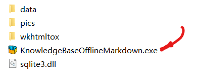

# FAQ

<video id="video" controls="" preload="none" poster="">
      <source id="mp4" src="https://youtu.be/tQP6bNu2BWo" type="video/mp4">
       
      
Your user agent does not support the HTML5 Video element.

</video>

## How to run 

1. Download KnowledgeBaseOfflineMarkdown_1.07.zip
2. unzip KnowledgeBaseOfflineMarkdown_1.07.zip
3. Double click on KnowledgeBaseOfflineMarkdown.exe

## How to add new note

Click on the following icon to add new note:

After edit, Then click on Save Icon:

