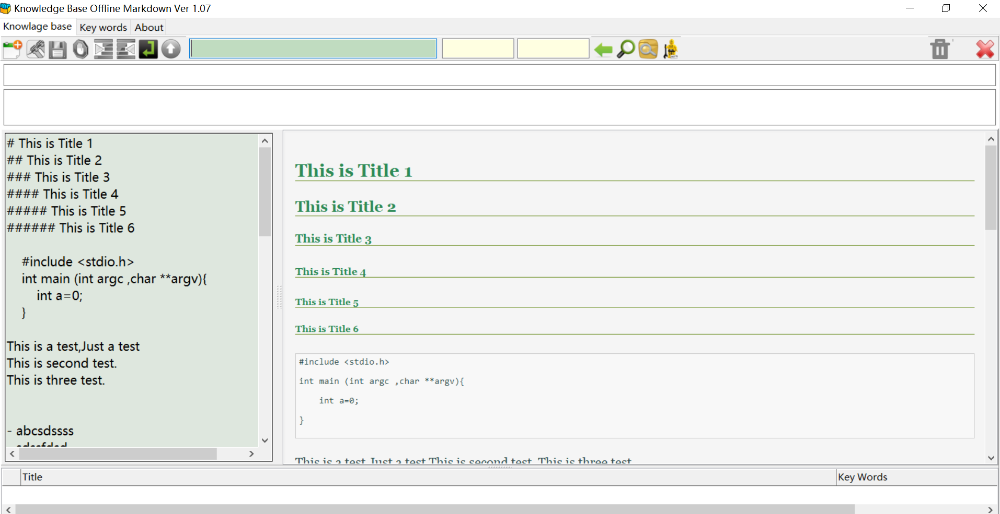

# codetyphon_km

codetyphon markdown SQLite knowledge tool

**License**: GNU General Public License v3.0  
**Program Language**: Free Pascal  
**Build Tool**: [codetyphon Studio](https://www.pilotlogic.com/sitejoom/index.php/projects/codetyphon-studio "codetyphon Studio")  
**Third party Tool**:  wkhtmltopdf  

[wkhtmltopdf](https://wkhtmltopdf.org "wkhtmltopdf")
 

## Knowledge Base Offline for Windows

THE SOFTWARE IS PROVIDED "AS IS", WITHOUT WARRANTY OF ANY KIND, EXPRESS OR IMPLIED, INCLUDING BUT NOT LIMITED TO THE WARRANTIES OF MERCHANTABILITY, FITNESS FOR A PARTICULAR PURPOSE AND NONINFRINGEMENT. IN NO EVENT SHALL THE AUTHORS OR COPYRIGHT HOLDERS BE LIABLE FOR ANY CLAIM, DAMAGES OR OTHER LIABILITY, WHETHER IN AN ACTION OF CONTRACT, TORT OR OTHERWISE, ARISING FROM, OUT OF OR IN CONNECTION WITH THE SOFTWARE OR THE USE OR OTHER DEALINGS IN THE SOFTWARE.

## Fetures

- Free Software
- Markdown format
- Store in the Sqlite dababase
- full-text searches
- Build by CodeTyphon 
- Export to Html file
- Export to PDF file(with wkhtmltopdf)
- Copy to ClipBoard
- Open with default web browser

## Screen shots 

## How to build 

### Download & install codetyphon 

1. [codetyphon Studio](https://www.pilotlogic.com/sitejoom/index.php/projects/codetyphon-studio "codetyphon Studio")

2. Use Typhon64 to open source/km.ctpr project file.

