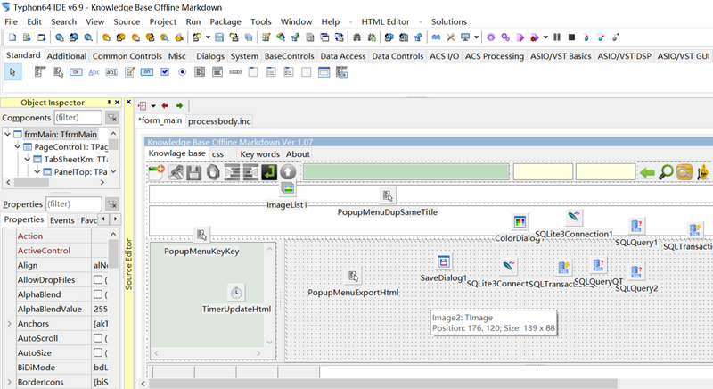

# Knowledge Base(Offline & markdown) for Windows

codetyphon markdown SQLite knowledge tool

**License**: [GNU General Public License v3.0](https://github.com/km-markdown/codetyphon_km/blob/master/LICENSE "GNU General Public License v3.0")  
**Program Language**: Free Pascal  
**Build Tool**: [codetyphon Studio](https://www.pilotlogic.com/sitejoom/index.php/projects/codetyphon-studio "codetyphon Studio")  

**Third party Tool**:   

1. wkhtmltopdf

[wkhtmltopdf](https://wkhtmltopdf.org "wkhtmltopdf")

2. sqlite3.dll 64bit Must be exist with KnowledgeBaseOfflineMarkdown.exe.

[sqlite-dll-win64-x64-3300100.zip](https://www.sqlite.org/download.html "sqlite-dll-win64-x64-3300100.zip")

## Fetures

- Free Software
- Markdown format
- Store in the Sqlite dababase
- full-text searches
- Build by CodeTyphon 
- Export to Html file
- Export to PDF file(with wkhtmltopdf)
- Copy to ClipBoard
- Open with default web browser

## How to use it(FAQ)

[Please look into the FAQ](https://github.com/km-markdown/codetyphon_km/blob/master/FAQ.md "FAQ")

## Screen shots 

## How to build with source code 

### Source code instructions

| Directory & file | Instruction                                  |
|------------------|----------------------------------------------|
| data             | km_data_fts.db in it,storeing markdown files |
| img              | Icons need by the project.                   |
| wkhtmltox        | Convert to PDF tool                          |
| form_about.frm   | CodeTypon form file                          |
| form_about.pas   | CodeTypon pascal source file                 |
| form_main.frm    | CodeTypon form file                          |
| form_main.pas    | CodeTypon pascal source file (Main Logics)   |
| km.ctpr          | CodeTypon project file                       |
| km.ctps          |                                              |
| km.ico           |                                              |
| km.ppr           |                                              |
| km.res           |                                              |

### Download & install codetyphon 

1. [codetyphon Studio](https://www.pilotlogic.com/sitejoom/index.php/projects/codetyphon-studio "codetyphon Studio")

2. Use Typhon64 to open source/km.ctpr project file.

